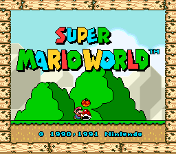

# CODENAME

A native Apple Silicon (arm64) macOS frontend for [libretro](https://www.libretro.com/) cores, built for game preservation and research.

Swift 6, Metal presentation, macOS 15+. Sandboxed with **zero** hardened-runtime exceptions and no network access in the app — the security posture is the point, not an afterthought (see [ADR 0001](docs/adr/0001-core-loading-and-entitlements.md)).

<p align="center">
  
  
</p>

<sub>Frames rendered by this host through the bundled Snes9x and Genesis Plus GX cores, captured with the project's own conformance tool. Game content shown is the property of its respective owners and is not distributed here.</sub>

## Status: pre-alpha, working emulation

What works today:

- **Plays Mega Drive/Genesis and SNES games** via bundled, pinned-source builds of Genesis Plus GX and Snes9x — verified at correct speed with audio, input, and deterministic save states by an automated conformance harness.
- **A real Mac app experience**: File → Open with type routing, Open Recent, a folder-scanning game library, battery-save (SRAM) persistence, three save-state slots (⌘S/⌘L), integer or aspect-fit scaling, ProMotion-aware frame pacing with dynamic audio rate control.
- **Infrastructure**: CI on arm64 runners (tests + thread sanitizer), a tag-driven release pipeline, and a [Sparkle](https://sparkle-project.org) update channel with an EdDSA-signed [appcast](https://lonkins.github.io/CODENAME/appcast.xml).

Why this exists: [OpenEmu](https://openemu.org) defined Mac-native emulation but has been dormant since 2023 with no Apple Silicon binary, and Rosetta 2's window is closing. CODENAME is an arm64-native, sandboxed, update-channeled successor built in the open.

## Install

Releases are distributed from [GitHub Releases](../../releases) as a `.dmg` with a SHA-256 checksum.

Current builds are **unsigned** (signing and notarization are deferred until the project matures — the release pipeline already supports them). macOS will refuse to open an unsigned downloaded app, so after copying `CODENAME.app` to `/Applications`:

```
xattr -cr /Applications/CODENAME.app
```

Verify your download first:

```
shasum -a 256 -c CODENAME-<version>.dmg.sha256
```

Only run this against releases you downloaded from this repository. If you prefer not to bypass Gatekeeper, build from source below — locally built apps carry no quarantine.

## What this is

- A macOS-native host application that loads libretro emulator cores and presents them through Metal, with system-standard audio (`AVAudioEngine`), input (`GameController` — DualSense, Xbox, 8BitDo, keyboard), and windowing.
- arm64 only, macOS 15.0 minimum. No Intel build, no universal binary.
- Curated emulator cores are bundled with releases as separately licensed plug-in works; the app never loads unsigned code (details and rationale in [ADR 0001](docs/adr/0001-core-loading-and-entitlements.md)).

## What this is not

- Not an emulator. Emulation comes from actively maintained upstream libretro cores.
- This project contains no BIOS files, ROMs, firmware, or decryption keys, and provides no guidance on acquiring them. Users supply their own legally obtained content.

## Building from source

Apple Silicon Mac with Command Line Tools (full Xcode not required):

```
./Scripts/make-app.sh
open build/CODENAME.app
```

Tests and lint: `swift test --package-path Packages/CODENAMEKit` (requires Xcode toolchain) and `swift format lint --strict --recursive Packages`. Release packaging is documented in [docs/RELEASING.md](docs/RELEASING.md). A Homebrew cask stub lives in [Casks/](Casks/) pending signed releases.

## Design decisions

Recorded as ADRs in [docs/adr/](docs/adr/): core loading & entitlements (0001), project format (0002). Frame pacing (0003) precedes the Phase 1 renderer.

## Contributing

See [CONTRIBUTING.md](CONTRIBUTING.md) — DCO sign-off required, third-party provenance rules, no content material of any kind. Security reports: [SECURITY.md](SECURITY.md).

## License

GPL-3.0-or-later ([LICENSE](LICENSE)). Bundled cores and dependencies are separate works listed in [THIRD_PARTY.md](THIRD_PARTY.md).
